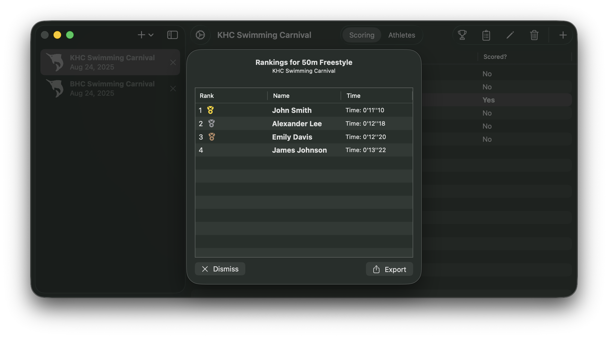

<h1>Sashimi: Race Timekeeping App</h1>

Sashimi is a lightweight and easy to use tool for tracking Athletics or Aquatic events, such as school sports carnivals. This is a project I made for school, but have since updated with mild improvements

Sashimi is currently only for macOS 14+, but I may work on a Windows port in future.
<h2>Carnivals</h2>
A carnival, a term used for a school sporting event in Australia, is made up of Events (eg. 100m Freestyle) and Athletes (competitors).
Sashimi allows multiple carnivals to be opened at once, so carnivals done annually can be compared, for example.
Carnivals can be saved with all their data into a single '.carnival' file.

<h2>Athletes</h2>
Sashimi Athletes can be created and modified using a simple menu, or imported/exported using .csv files.

<h2>Events</h2>
Events can be open, or tied to specific age or sex. Sashimi will filter 'potential athletes' who can participate in an event, and athletes may be chosen simply by dragging and dropping them into the event. 

<h2>Ranks</h2>
Ranks may be viewed and exported when an event is complete. Event results can also be overridden by rescoring.

<h1>Documentation</h1>
The User Guide is provided in HTML form, and can be found in Code\Documentation\. This can also be viewed by selecting 'View Documentation' from the Welcome Screen.
I've also chosen to include the original design documents produced as part of this school project. They will provide some insight to the inner workings of the app but may not fully reflect it as the project has evolved over time.
